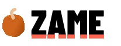

# Zame Engine

A small and basic game engine / game development framework written in D Programming Language.
Licensed under the Apache License, Version 2.0. *See [LICENSE.md](LICENSE.md)*

Created By One and Only Zoda.

## Supports Multiple Platforms
| Platform | Supported | Features |
| --- | --- | --- |
| Windows | Yes | - |
| Raylib | Yes | - |
| Html5 | In Development | - |